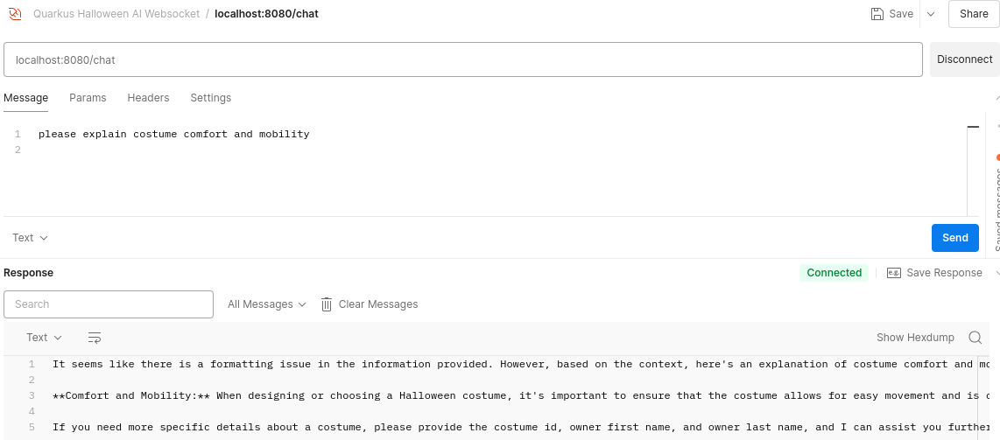
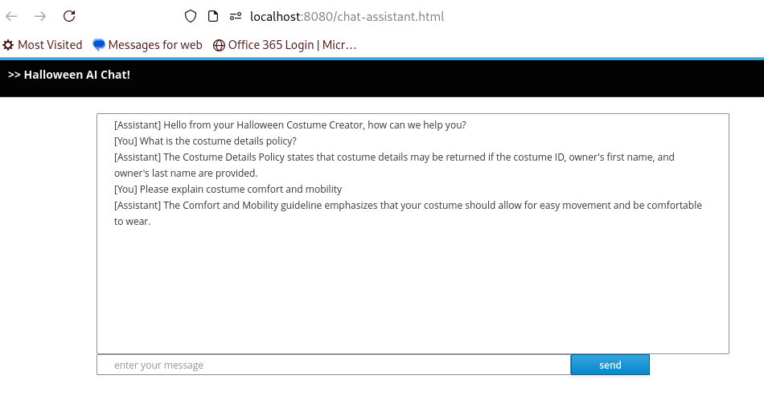
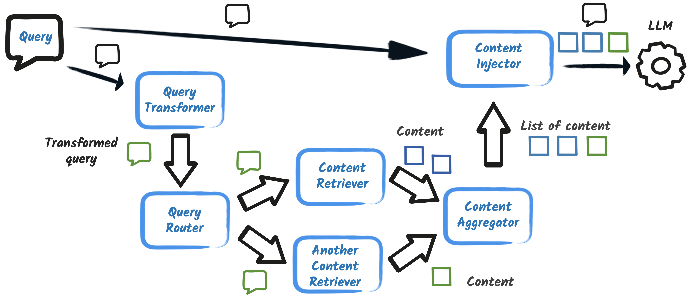

# Additional RAG Pattern

In this section, we will learn about using the RAG pattern with our own customizations and embedding model.

## Changing the properties file

Open the **application.properties** file and remove the following configuration.  It's easiest to simply comment it out for later
reference.

````Java
quarkus.langchain4j.easy-rag.path=src/main/resources/rag
quarkus.langchain4j.easy-rag.max-segment-size=100
quarkus.langchain4j.easy-rag.max-overlap-size=25
quarkus.langchain4j.easy-rag.max-results=3
````

Now, let's open the **pom.xml** file and remove the following dependency:

````Java
<dependency>
    <groupId>io.quarkiverse.langchain4j</groupId>
    <artifactId>quarkus-langchain4j-easy-rag</artifactId>
    <version>${quarkus-langchain4j.version}</version>
</dependency>
````

> [!TIP]
> You could also open a terminal and remove it using the Quarkus CLI
> ````Bash
> $ quarkus ext remove easy-rag
> ````

## Introduce an Embedding Model

One of the core components of the RAG pattern is the embedding model. The embedding model is used to transform the text 
into numerical vectors. These vectors are used to compare the text and find the most relevant segments.

Selecting a good embedding model is crucial. In the previous step, we used the default embedding model provided by OpenAI. 
We can however use our own embedding model as well.

In this step, we will use the **bge-small-en-q** embedding model.

We can add this by adding the following to our pom.xml file:

````Java
<dependency>
    <groupId>dev.langchain4j</groupId>
    <artifactId>langchain4j-embeddings-bge-small-en-q</artifactId>
    <version>0.35.0</version>
</dependency>
````
> [!TIP]
> Alternatively, we can use the Quarkus CLI
> ````Bash
> quarkus ext add dev.langchain4j:langchain4j-embeddings-bge-small-en-q:0.35.0
> ````

With this dependency, we can now provide the bge-small-en-q embedding model and it will run locally on our machine instead of 
sending our document to a remote service to compute the embeddings.

The bge-small-en-q model generates vectors of size 384.

We can use the model and the associated CDI bean by adding the following to our application.properties file:

````Java
quarkus.langchain4j.embedding-model.provider=dev.langchain4j.model.embedding.onnx.bgesmallenq.BgeSmallEnQuantizedEmbeddingModel
````

## The Vector Store

Previously, we used an _in memory_ embedding store.  Now, we can persist embeddings between restarts using options like; Redis, 
Infinispan etc...

For our example, we will use the PostgreSQL pgVector store.

Add the following to your pom.xml file:

````Java
<dependency>
    <groupId>io.quarkiverse.langchain4j</groupId>
    <artifactId>quarkus-langchain4j-pgvector</artifactId>
    <version>${quarkus-langchain4j.version}</version>
</dependency>
````

> [!TIP]
> Alternatively, we can use the Quarkus CLI:
> ````Bash
> quarkus ext add langchain4j-pgvector 
> ````

Like many embedding stores, we need to know the size of the embeddings that will be stored in advance. 

Add the following to our application.properties file:

````Java
quarkus.langchain4j.pgvector.dimension=384
````

Notice that this value is the size of the vectors generated by the **bge-small-en-q** embedding model.

With this, we can now use the io.quarkiverse.langchain4j.pgvector.PgVectorEmbeddingStore CDI bean to store and retrieve the embeddings.

## Ingesting documents into the vector database

Add the following to our application.properties file:

````Java
rag.location=src/main/resources/catalog
````

This custom configuration property is used to specify the location of the documents that will be ingested into the vector store.

We had previously commented out, or deleted, the quarkus.langchain4j.easy-rag.path

We now need to create an _ingestor_.  The role of the _ingestor_ is to ingest, read, the documents and store the embeddings into the vector store.


Create a class called **RagINgestion** with the following:

````Java
package com.devcorner.developers;

import static dev.langchain4j.data.document.splitter.DocumentSplitters.recursive;

import java.nio.file.Path;
import java.util.List;

import jakarta.enterprise.context.ApplicationScoped;
import jakarta.enterprise.event.Observes;

import org.eclipse.microprofile.config.inject.ConfigProperty;

import io.quarkus.logging.Log;
import io.quarkus.runtime.StartupEvent;

import dev.langchain4j.data.document.Document;
import dev.langchain4j.data.document.loader.FileSystemDocumentLoader;
import dev.langchain4j.model.embedding.EmbeddingModel;
import dev.langchain4j.store.embedding.EmbeddingStore;
import dev.langchain4j.store.embedding.EmbeddingStoreIngestor;

@ApplicationScoped
public class RagIngestion {

    /**
     * Ingests the documents from the given location into the embedding store.
     *
     * @param ev             the startup event to trigger the ingestion when the application starts
     * @param store          the embedding store the embedding store (PostGreSQL in our case)
     * @param embeddingModel the embedding model to use for the embedding (BGE-Small-EN-Quantized in our case)
     * @param documents      the location of the documents to ingest
     */
    public void ingest(@Observes StartupEvent ev,
                       EmbeddingStore store, EmbeddingModel embeddingModel,
                       @ConfigProperty(name = "rag.location") Path documents) {
        store.removeAll(); // cleanup the store to start fresh (just for demo purposes)
        List<Document> list = FileSystemDocumentLoader.loadDocumentsRecursively(documents);
        EmbeddingStoreIngestor ingestor = EmbeddingStoreIngestor.builder()
                .embeddingStore(store)
                .embeddingModel(embeddingModel)
                .documentSplitter(recursive(100, 25))
                .build();
        ingestor.ingest(list);
        Log.info("Documents ingested successfully");
    }

}
````
This class ingests the documents from the **rag.location** location into the vector store. It runs when the application 
starts due to the **@Observes StartupEvent ev** parameter.

Additionally, it receives:

- the **PgVectorEmbeddingStore** bean to store the embeddings,
- the **BgeSmallEnQuantizedEmbeddingModel** bean to generate the embeddings,
- the **rag.location** configuration property to know where the documents are.

The **FileSystemDocumentLoader.loadDocumentsRecursively** method loads the documents from the given location.

The **EmbeddingStoreIngestor** class is used to ingest the documents into the vector store. This is the cornerstone of the 
ingestion process. Configuring it correctly is crucial to the accuracy of the RAG pattern. Here, we use a recursive 
document splitter with a segment size of 100 and an overlap size of 25.

> [!IMPORTANT]
> The splitter, the segment size, and the overlap size are crucial to the accuracy of the RAG pattern. It depends on the 
> documents you have and the use case you are working on. There is no one-size-fits-all solution. You may need to 
> experiment with different configurations to find the best one for your use case.

## Using a retriever and augmentor

Once the documents are ingested into the vector store, we need to be able to retrieve them.  The retriever is what is 
responsible for finding the relevant segments for a given query.

The augmentor is then responsible for extending the prompt with the retrieved segments.


Create the **RagRetriever** class as follows:

````Java
package com.devcorner.developers;

import java.util.List;

import jakarta.enterprise.context.ApplicationScoped;
import jakarta.enterprise.inject.Produces;

import dev.langchain4j.data.message.UserMessage;
import dev.langchain4j.model.embedding.EmbeddingModel;
import dev.langchain4j.rag.DefaultRetrievalAugmentor;
import dev.langchain4j.rag.RetrievalAugmentor;
import dev.langchain4j.rag.content.Content;
import dev.langchain4j.rag.content.injector.ContentInjector;
import dev.langchain4j.rag.content.retriever.EmbeddingStoreContentRetriever;
import dev.langchain4j.store.embedding.EmbeddingStore;

public class RagRetriever {

    @Produces
    @ApplicationScoped
    public RetrievalAugmentor create(EmbeddingStore store, EmbeddingModel model) {
        var contentRetriever = EmbeddingStoreContentRetriever.builder()
                .embeddingModel(model)
                .embeddingStore(store)
                .maxResults(3)
                .build();

        return DefaultRetrievalAugmentor.builder()
                .contentRetriever(contentRetriever)
                .build();
    }
}
````

The **create** method will handle both the retrieval and the prompt augmentation in this case.  It will use the 
**PgVectorEmbeddingStore** bean to retrieve the embeddings and the **BgeSmallEnQuantizedEmbeddingModel** bean to generate
the embeddings.

> [!IMPORTANT]
> It's crucial to use the same embedding model for the retriever and the ingestor.
> Otherwise, the embeddings will not match, and the retriever will not find the relevant segments.

The EmbeddingStoreContentRetriever class is used to retrieve the most relevant segments. We configure the maximum number
of results to 3 (like in the previous step). Remember that more results means a bigger prompt. Not a problem here, but some LLMs have restrictions on the prompt (context) size.

The content retriever can also be configured with a filter (applied on the segment metadata), requires a minimum score, etc.

With this retriever, we can now build the prompt augmentation. We create a DefaultRetrievalAugmentor with the content 
retriever. It will:

- Retrieve the most relevant segments for a given query (using the content retriever),
- Augment the prompt with these segments.

The augmentor has other options, like how the prompt is modified, how to use multiple retrievers, etc.

### Testing

Restart the application:

````Bash
quarkus dev
````

Notice when the application starts, it will ingest the documents into the vector store.

Open Postman and let's ask it a question:



If we open our chat window, it should look something like the following with the same question:



## More Advanced RAG

We can use different embedding models, different vector stores, and different retrievers.  We can also extend the process of
retrieval and augmentation:



We can use multiple retrievers, filters and require a minimum score.  When using multiple retrievers, we can combine the results
and use the best one.

Let's customize the content injected into the segments by editing the **create** method of the **RagRetriever**:

```Java #30-38
package com.devcorner.developers;

import java.util.List;

import jakarta.enterprise.context.ApplicationScoped;
import jakarta.enterprise.inject.Produces;

import dev.langchain4j.data.message.UserMessage;
import dev.langchain4j.model.embedding.EmbeddingModel;
import dev.langchain4j.rag.DefaultRetrievalAugmentor;
import dev.langchain4j.rag.RetrievalAugmentor;
import dev.langchain4j.rag.content.Content;
import dev.langchain4j.rag.content.injector.ContentInjector;
import dev.langchain4j.rag.content.retriever.EmbeddingStoreContentRetriever;
import dev.langchain4j.store.embedding.EmbeddingStore;

public class RagRetriever {

    @Produces
    @ApplicationScoped
    public RetrievalAugmentor create(EmbeddingStore store, EmbeddingModel model) {
        var contentRetriever = EmbeddingStoreContentRetriever.builder()
                .embeddingModel(model)
                .embeddingStore(store)
                .maxResults(3)
                .build();

        return DefaultRetrievalAugmentor.builder()
                .contentRetriever(contentRetriever)
.contentInjector(new ContentInjector() {
    @Override
    public UserMessage inject(List<Content> list, UserMessage userMessage) {
        StringBuffer prompt = new StringBuffer(userMessage.singleText());
        prompt.append("\nPlease, only use the following information:\n");
        list.forEach(content -> prompt.append("- ").append(content.textSegment().text()).append("\n"));
        return new UserMessage(prompt.toString());
    }
})
                .build();
    }
}
```


